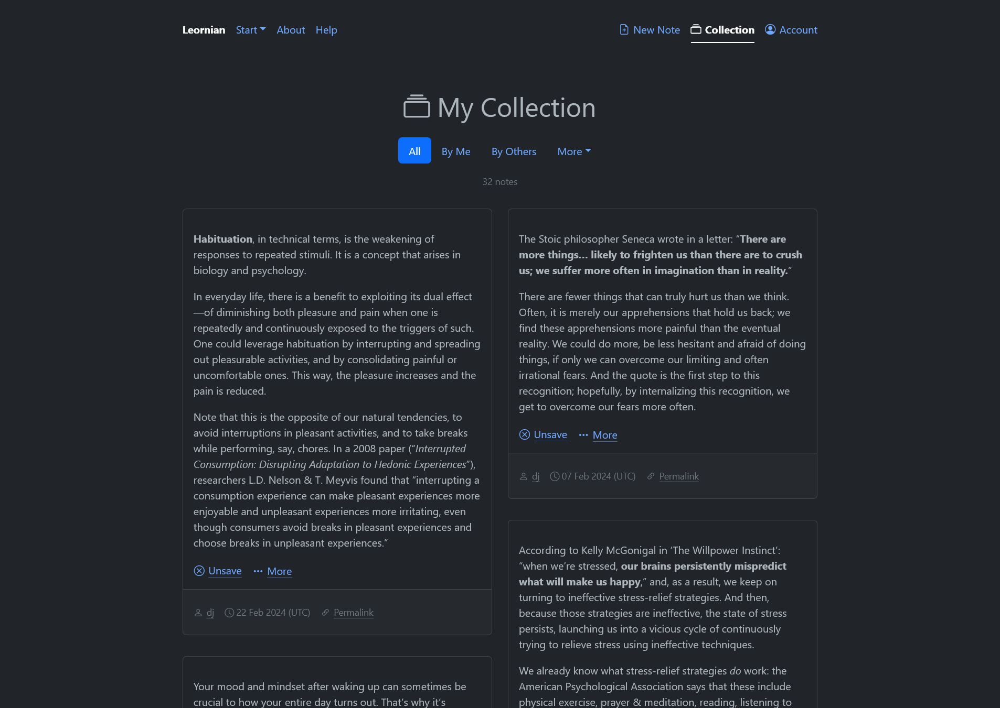

# Leornian

Leornian is a notes sharing and learning tool built with the [Django](https://www.djangoproject.com/) (Python) web framework. It was at one point a service hosted at `https://leornian.info/`.

The project is no longer maintained, having been [succeeded](https://tech.reversedelay.net/2024/05/rightsizing-a-platform-into-a-tool/) by [Leornianite](https://github.com/djramones/leornianite).

For an extensive background, see the blog post “[About the Leornian project](https://tech.reversedelay.net/2023/12/about-the-leornian-project/)”.
